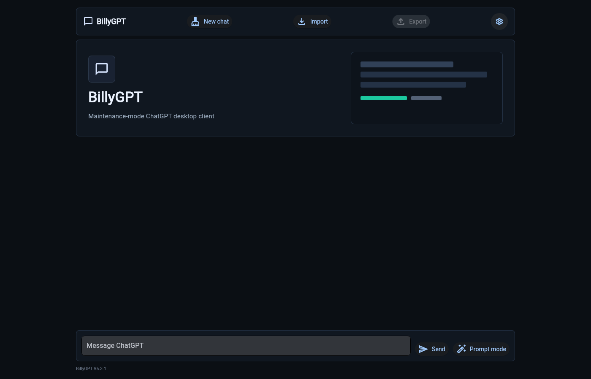

# BillyGPT

> Maintenance-mode project from March 2023. BillyGPT is kept public as an early ChatGPT API desktop client with reproducible setup, safer local key handling, and a small smoke-check path for future maintenance.

BillyGPT was a free, open-source, cross-platform ChatGPT desktop client built around prompt optimization, local chat history, editable conversations, and bring-your-own API key usage.



## Status

- Maintenance-mode legacy project.
- Built for the early ChatGPT API era in 2023.
- Uses the OpenAI Python SDK version pinned in `requirements.txt`.
- Kept as a stable historical desktop-client implementation.

## Features

- Local chat history storage.
- Prompt-optimization mode for more structured answers.
- Long conversation summarization.
- Import and export of chat history.
- Editable message role and content.
- Custom font selection.
- Bring-your-own OpenAI API key.

## Usage

Python 3.10 is the verified runtime for this legacy dependency set.

Install dependencies and run:

```bash
pip install -r requirements.txt
python main.py
```

For a fully pinned environment, use:

```bash
pip install -r requirements-lock.txt
```

For safer local usage, prefer setting your key through the environment:

```bash
export OPENAI_API_KEY="your-key-here"
python main.py
```

The settings dialog keeps an entered key for the current process only. For repeat use, set `OPENAI_API_KEY` in your shell or local environment manager.

## Smoke Check

Run this after installing dependencies:

```bash
python scripts/smoke_check.py
```

The smoke check verifies imports, API key loading, and chat persistence helpers without opening the UI.

To check that the repository's tracked files are sufficient for a fresh clone, run:

```bash
python scripts/check_release_files.py
```

For a browser-rendered startup check, run this with Chrome or Chromium installed:

```bash
python scripts/check_frontend_startup.py
```

The startup check runs a local Flet web server and a headless browser. It does not open the desktop app window or a visible browser window.

## Troubleshooting

Install dependencies before running the checks:

```bash
pip install -r requirements.txt
```

If the front-end startup check cannot find Chrome, set `CHROME_BIN` to a local Chrome or Chromium executable. The script intentionally fails in environments without a headless browser instead of opening the desktop UI.

## Security Note

Never commit API keys or local chat logs.

This repository ignores legacy `APIKEY.txt` files and chat logs, but if you fork or copy the project, check your changes before pushing:

```bash
git status --short
git diff --cached
```

If a key was ever committed, delete the key in the provider dashboard and create a new one. Removing it from Git history is not enough.

## Framework

Built with Flet, targeting desktop and cross-platform experiments.

## License

MIT.

## Historical Context

BillyGPT was made during the first public ChatGPT API wave. Its value today is mostly historical: it captured early product ideas around prompt optimization, local control, editable conversations, and personal AI clients.
